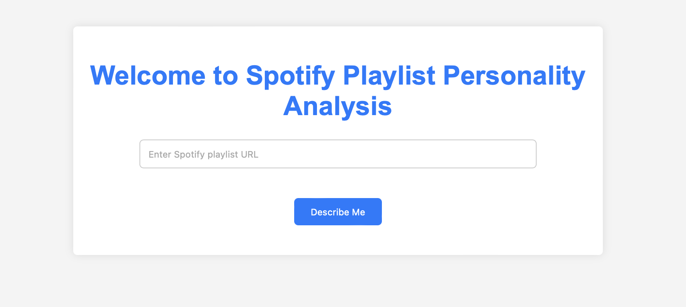
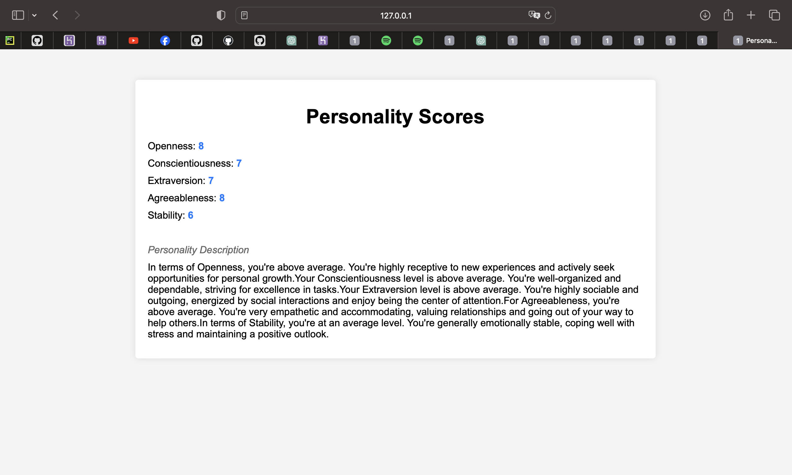

# Personality 2 Big 5 

Personality 2 Big 5  is a Python application 
that analyzes Spotify playlist data to generate 
personality descriptions based on the Big Five 
personality traits. The model assigns scores for 
Openness, Conscientiousness, Extraversion, 
Agreeableness, and Stability. Users also receive verbal summaries of 
their character traits. 

### Methodology
This project utilizes the Spotify API to 
analyze user playlists and extract their preferred 
music genres. By integrating findings from a study 
conducted by Anderson et al. (2021), which establishes 
correlations between music genres and personality traits, 
this tool assigns scores to users in various personality 
traits based on their listening habits. The correlation 
table serves as the foundation for mapping genres to personality traits. 

Research link: 
http://journals.sagepub.com/doi/10.1177/1948550620923228

### WEB
This Python application utilizes a Flask server with a simple HTML/CSS 
frontend where users can input the link to their public Spotify playlist. 

Upon submission, users are redirected to a page where their personality scores and 
descriptions, based on the Big Five personality traits, are presented.

